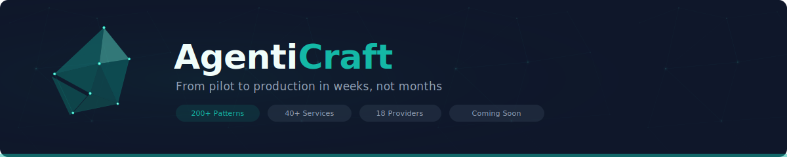

<div align="center">

<picture>
  <source media="(prefers-color-scheme: dark)" srcset="readme-banner.svg">
  <source media="(prefers-color-scheme: light)" srcset="readme-banner.svg">
  
</picture>

Build, deploy, and scale AI agents with enterprise-grade security, observability, and governance.

---

`200+ Patterns` · `40+ Mesh Services` · `18 LLM Providers` · `Defense-in-Depth Security` · `Open Protocols`

[](https://agenticraft.ai)
[](https://python.org)

---

</div>

## The Challenge

Most companies can build a prototype AI agent in days. Getting it to production — secure, reliable, compliant — takes months and often fails entirely.

**65%** of AI pilots stall before scaling. Only **11%** reach full production. **86%** need tech stack upgrades.

**AgentiCraft bridges this gap** — providing both AI agent logic and enterprise infrastructure in one unified platform.

## What We Offer

- **200+ agent patterns** across reasoning, coordination, workflow, resilience, RAG, safety, and planning
- **40+ mesh services** with defined SLAs and automatic failover
- **18 LLM providers** through one unified interface — switch models without changing code
- **Defense-in-depth security** with enterprise compliance controls
- **Open protocol support** — MCP (Model Context Protocol) and A2A (Agent-to-Agent) for tool integration and inter-agent communication
- **Built-in evaluation** with industry-standard benchmarks

## Quick Start

```python
from agenticraft import Craft

# Create an agent with the fluent builder API
agent = (
    Craft.agent("Assistant")
    .model("gpt-4o")
    .memory("conversation")
    .tools(["web_search", "calculator"])
    .create()
)

response = await agent.run("Analyze this quarterly report")
```

### Multi-Provider Support

```python
from agenticraft import Craft

openai_agent  = Craft.agent("GPT").model("gpt-4o").create()
claude_agent  = Craft.agent("Claude").model("claude-sonnet-4-5").create()
gemini_agent  = Craft.agent("Gemini").model("gemini-3-pro").create()
local_agent   = Craft.agent("Local").model("ollama/llama3").create()
```

### Multi-Agent Teams

```python
from agenticraft import Craft

team = (
    Craft.team("MarketResearch")
    .agents([
        Craft.analyst("Researcher").model("gpt-4o"),
        Craft.analyst("Validator").model("claude-sonnet-4-5"),
        Craft.writer("Synthesizer").model("gemini-3-pro"),
    ])
    .strategy("consensus")
    .create()
)

report = await team.run("Analyze Q4 market trends and provide recommendations")
```

## Contact

- **Website:** [agenticraft.ai](https://agenticraft.ai)
- **Email:** hello@agenticraft.ai
- **Security:** security@agenticraft.ai
