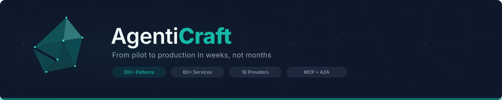

<div align="center">

<picture>
  <source media="(prefers-color-scheme: dark)" srcset="readme-banner.svg">
  <source media="(prefers-color-scheme: light)" srcset="readme-banner.svg">
  
</picture>

The production infrastructure layer for AI agents. Build, deploy, and scale multi-agent systems with a high-performance Rust data plane, formal verification, and enterprise-grade governance.

---

`Rust Data Plane` · `100+ Patterns` · `60+ Mesh Services` · `17 LLM Providers` · `Formal Verification` · `MCP + A2A`

[](https://agenticraft.ai)
[](https://agenticraft.ai/docs)
[](https://agenticraft.ai/blog)
[](https://python.org)

---

</div>

## The Problem

88% of AI pilots never reach production. The bottleneck isn't the models — it's the infrastructure around them. Every team that gets serious about production agents ends up building the same operational stack from scratch: observability, reliability, cost control, security, deployment.

**AgentiCraft is that stack.** One platform. One command. Any scale.

## What Makes This Different

**High-performance Rust data plane.** A 29-stage middleware pipeline processes every agent request at microsecond latency — intelligent provider routing, PII masking, budget enforcement, circuit breakers, and compliance audit trails. Policy enforcement happens in the data plane, not in Python.

**Formal verification.** Agent protocols are verified before deployment. If a coordination pattern has a deadlock or a protocol violation, you find it at compile time — not in a 3 AM incident.

**One file, any platform.** Define your entire multi-agent system in `app.yaml` — agents, topology, workflows, policies, plugins. The runtime compiles it into infrastructure and deploys it on a laptop, Docker, Kubernetes, or an edge device.

**Research-backed reliability.** In our fault tolerance experiments, mesh-coordinated agents maintained 100% task completion with zero cascade failures across all tested failure rates. Hub-and-spoke dropped to 82% at 20% failure rate and 72% at 30%. The architecture isn't theoretical — it's tested.

## Architecture

| Layer | Name | What It Does |
|-------|------|-------------|
| 0 | **Foundation** | Formal verification, session types, topology analysis |
| 1 | **Transport** | Async messaging between agents |
| 2 | **Data Plane** | Rust proxy — per-request enforcement at microsecond latency |
| 3 | **Control Plane** | 60+ mesh services — orchestration, policies, LLM management |
| 4 | **Runtime** | Universal deployment — laptop, Docker, Kubernetes, edge |
| 5 | **Developer Experience** | `craft` CLI, SDK, templates, test harness |
| 6 | **App Framework** | Declarative app manifest, plugin system, marketplace |
| 7 | **Products** | End-user applications — bots, dashboards, enterprise tools |

## Define Your System

```yaml
# app.yaml — agents, topology, workflows, policies in one file
name: research-team
agents:
  - id: researcher
    capabilities: [web_search, paper_analysis]
    models: { default: gpt-5-mini, for_analysis: gpt-5.4 }
    memory: { tiers: { hot: { backend: redis } } }
    autonomy: { level: 0.9 }

  - id: analyst
    capabilities: [data_analysis, visualization]

topology:
  connections:
    - { from: researcher, to: analyst, type: delegate }

workflows:
  - id: deep-dive
    pattern: pipeline
    steps:
      - { id: search, agent: researcher }
      - { id: analyze, agent: analyst }

policies:
  budgets: { org: { monthly_usd: 10.0 } }
  guardrails: { pii: { action: mask } }
  sla: { researcher: core, analyst: standard }
```

```bash
craft start --app app.yaml
```

## By the Numbers

- **100+ production patterns** — reasoning, coordination, workflow, resilience, RAG, safety, planning
- **60+ mesh services** with defined SLAs — security, deployment, gateway, observability, and more
- **17 LLM providers** with automatic failover — OpenAI, Anthropic, Google, Mistral, Azure OpenAI, Ollama, and 11 more
- **MCP + A2A native** — open protocols for tool integration and inter-agent communication
- **3 plugin tiers** — agent, app, and middleware plugins for extensibility without forking

## Public Libraries

| Library | Description |
|---------|-------------|
| [agenticraft-foundation](https://github.com/agenticraft/agenticraft-foundation) | Formally verified mathematical foundations for multi-agent AI coordination. Process algebra, session types, spectral topology, temporal logic. 1,165 tests, zero runtime dependencies. |

## Links

- **[Website](https://agenticraft.ai)** — platform overview and early access
- **[Blog](https://agenticraft.ai/blog)** — architecture decisions, research findings, technical deep dives
- **[Foundation Docs](https://agenticraft.ai/docs/foundation/)** — formal verification toolkit
- **Email:** hello@agenticraft.ai
